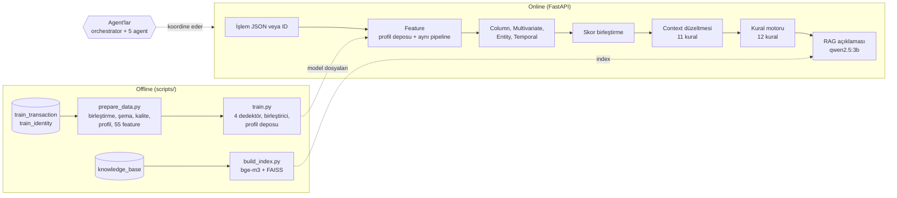
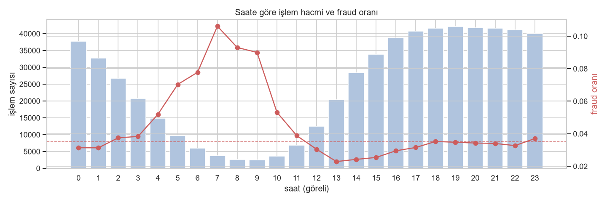
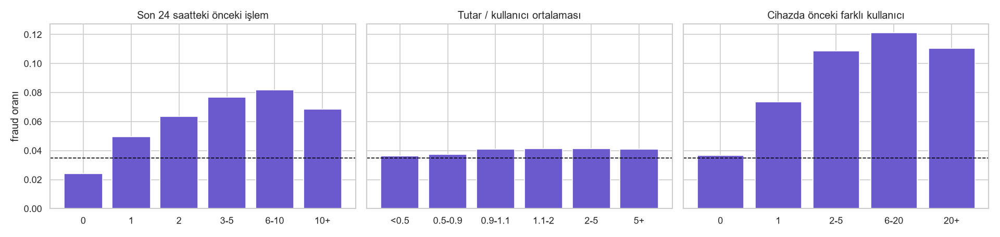
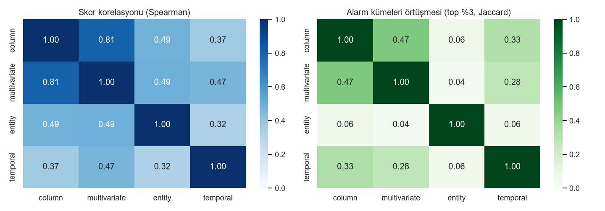
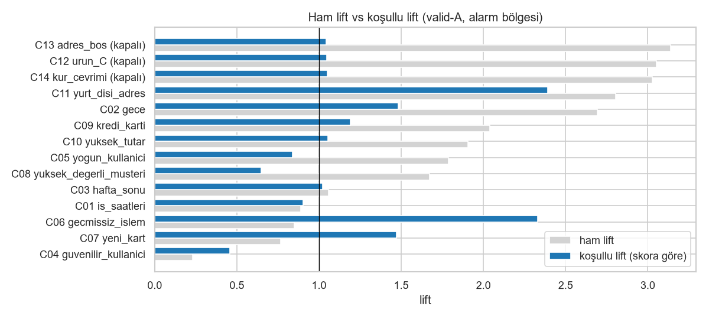
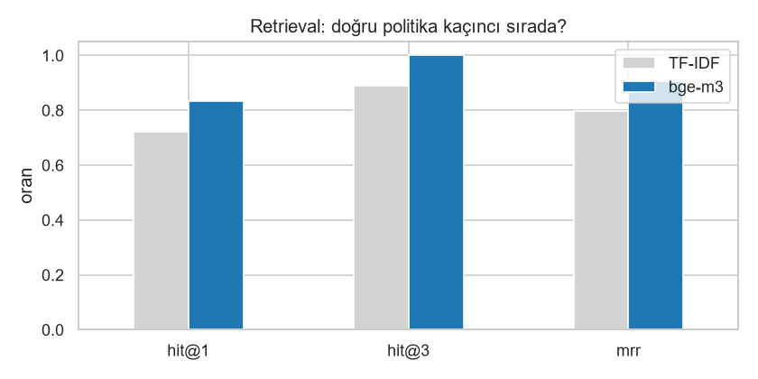
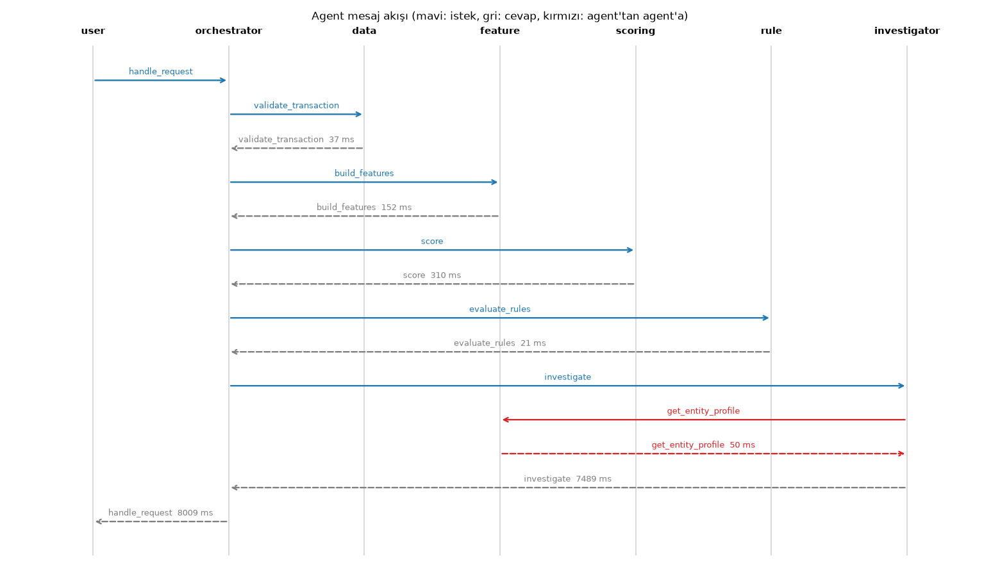

# Teknik Doküman - Fraud AI Platform

Bu doküman IEEE-CIS verisi üzerinde geliştirdiğim fraud / anomali tespit platformunun tasarım kararlarını, ölçüm
sonuçlarını ve sınırlamalarını anlatıyor. Kurulum için [README](../README.md), çalışırken tuttuğum notlar için
[notes.md](notes.md).

## 1. Genel bakış ve değerlendirme yöntemi

Sistem tek bir modelden değil, art arda çalışan katmanlardan oluşuyor. İşlemden feature'lar çıkarılıyor, dört ayrı anomali
dedektörü skor üretiyor, skorlar birleştiriliyor, iş bağlamına göre düzeltiliyor, kural motoru karar veriyor ve LLM bu kararı
politika dokümanlarına dayanarak açıklıyor. Agent'lar bu adımları koordine ediyor, hepsi FastAPI üzerinden sunuluyor.

Dedektörler etiketsiz çalışıyor. `isFraud` kolonunu sadece ölçüm ve birkaç parametrenin kalibrasyonu için kullandım (skor
ağırlıkları, context çarpanları, kural eşiklerinin kontrolü). Hiçbir feature etiketten türetilmiyor.

Veriyi `TransactionDT` sırasına göre, karıştırmadan üçe böldüm:

| Dönem | Kapsam | İşlem | Fraud oranı | Ne için |
|---|---|---|---|---|
| train | ilk %60 | 354.324 | %3,38 | dedektörlerin eğitimi |
| valid | %60-80 | 118.108 | %3,90 | tasarım kararları (gerektiğinde valid-A / valid-B diye ikiye bölündü) |
| test | son %20 | 118.108 | %3,44 | sadece final rapor (final modeller train+valid ile eğitildi) |

Aynı veride hem eğitip hem ölçmek fazla iyimser sonuç veriyor; gerçekte model geçmişte eğitilip gelecekte çalışıyor. Bu bölme
aylar arasındaki drift'i de ortaya çıkardı (6.2). Ana metrik olarak PR-AUC'yi ve en riskli %3'e alarm verildiğindeki
precision / recall'u kullandım. Fraud oranı %3,4 iken ROC-AUC fazla iyimser kalıyor; %3'lük alarm bütçesi ise analist
kapasitesini temsil ediyor.

İki konuda baştan açık olmak istiyorum. İlk denemelerde üç tasarım seçimini (column dedektörünün toplama yöntemi, Isolation
Forest girdisi, entity bileşenleri) son %20'ye bakarak yapmıştım; fark edince üçünü de valid'de tekrarladım, sonuç değişmedi.
İkincisi, kural setindeki bir sorunu test döneminde buldum ve düzelttim (8.5). Bu yüzden kural motorunun test sonuçları biraz
iyimser.

## 2. Mimari

API ve agent'lar hiçbir şeyi baştan hesaplamıyor, offline script'lerin ürettiği dosyaları okuyor:

- `prepare_data.py`: ham CSV'lerden birleşik tablo, şema, kalite raporu, profil ve 55 feature (`data/processed/`, `artifacts/`)
- `train.py`: 4 dedektör, skor birleştirici, katman skorları ve profil deposu
- `build_index.py`: politika dokümanlarından FAISS index'i

Kodda sabit bir kolon adı ya da eşik yok. Yollar, kolon rolleri, eşikler, ağırlıklar ve LLM modeli `config/settings.yaml`'da
duruyor ve açılışta Pydantic ile doğrulanıyor. Context ve iş kuralları ayrı YAML dosyalarında. Başka bir işlem verisine geçmek
için config'i değiştirmek yeterli olmalı.

Kullandığım design pattern'ler (bonus):

- Strategy: dedektörler (`BaseDetector`), normalizasyon yöntemleri, çakışma çözüm stratejileri, embedder, planlama modu
- Factory / Registry: dedektör factory'si, koşul operatörleri, `build_agent_system`
- Pipeline: `FeaturePipeline` (yeni feature grubu eklemek yeni bir builder sınıfı yazmak demek)
- Template Method: `WeightedComponentDetector`, `BaseAgent.handle`
- Repository: `EntityProfileStore`, `TransactionRepository`
- Facade: `ScoringService`, `ExplainService`
- Mediator: `MessageBus`
- Adapter: `BaseLLM` / `OllamaLLM`, embedder sınıfları
- Singleton + DI: `dependency_injector` container'ı

## 3. Veri ve profil (Adım 1-2)

Ayrıntılar notebook 01 ve 02'de.

İki tabloyu `TransactionID` ile left join yaptım. Identity bilgisi işlemlerin sadece %24,4'ünde var, inner join işlemlerin
dörtte üçünü atardı. Sonuç 590.540 satır ve 435 kolon. float64 kolonları float32'ye çevirince bellek 2,08 GB'tan 1,13 GB'a
indi; tutar kolonunda 3 ondalık hanede hiçbir değer değişmedi.

Kolon tiplerini sadece pandas tipine bakarak belirlemek mümkün değil: `card1` tam sayı ama bir kod, `C1` de tam sayı ama bir
sayaç. Önce config'teki rollere, sonra değer sayısına (sabit / binary), sonra Kaggle açıklamasındaki kategorik listeye
(config'te override olarak), en son metin tipine bakıyorum; kalanlar sayısal. Sonuç 375 sayısal, 31 kategorik (13'ü yüksek
cardinality) ve 26 binary kolon. Her kolonun neden o tipi aldığı şemada `reason` alanında yazıyor.

Profilde öne çıkanlar:

- Eksiklik bloklar halinde. Boşluk maskesi aynı olan 26 kolon grubu var; en büyüğünde 46 V kolonu işlemlerin %77,9'unda
  birlikte boş. 12 kolon %90'dan fazla boş. Bu yüzden boşluk bayraklarını kolon başına değil blok başına yaptım.
- Boş olmanın kendisi bir sinyal. `addr1` boşken fraud %11,8, doluyken %2,5. Identity kolonlarında ilişki ters: boşken fraud
  oranı yaklaşık beşte bir.
- Hacmin en düşük olduğu saatler (göreli 05-11) fraud oranının en yüksek olduğu saatler; saat 07'de fraud %10,6. Bu gözlem
  saat kaydırma kararına götürdü (bölüm 4).
- Günler arasında fraud oranı %3,2 ile %3,7 arasında, neredeyse sabit. Hafta sonu düzeltmesinin küçük kalması gerektiğini
  burada gördüm.
- Tutar çok çarpık (skew 14,4, log1p sonrası 0,49). Tutarların %10,5'i 3 ondalık haneli, muhtemelen kur çevrimi; bunlarda
  fraud %11,7.
- Ürün C'de fraud %11,7, kredi kartında %6,7 (banka kartında %2,4), mobil cihazda %10,2.
- IQR, medyan kolonda işlemlerin %10'unu aykırı sayıyor, robust z %3,7'sini. Çarpık veride robust z'yi seçtim. V148-V156
  kolonlarının aykırı değerlerinde fraud oranı %95'in üstünde.
- Sayısal kolonların çoğu birbirinin kopyası gibi; |r| > 0,95 ile gruplayınca 375 kolondan 260 temsilci kalıyor (C1, C2, C4,
  C6, C8, C10 ve C11 tek grup).
- Kalite: ID tekrarı yok. ID dışında birebir aynı 3 çift satır var (aynı saniye, ardışık ID; büyük ihtimalle çift gönderim).
  D4, D11 ve D15'te negatif gün farkları, e-postada `gmail` / `gmail.com` gibi yazım farkları var; bunları feature adımında
  temizledim.
- Tek başına en iyi kolon D5 (AUC 0,743). 138 kolonun AUC'si 0,6'nın üstünde ama hiçbiri tek başına yeterli değil.

## 4. Kullanıcı (uid) tanımı ve varsayımlar

Veride kullanıcı kolonu yok, bir sözde kullanıcı tanımlamam gerekti. Adayları karşılaştırırken `purity_fraud` diye bir ölçü
kullandım: fraud işlemlerin, çoğunluğu fraud olan bir entity içinde bulunma oranı. Etiketi burada sadece tanımları kıyaslamak
için kullandım.

| uid adayı | entity sayısı | geçmişi olan işlem | purity_fraud |
|---|---|---|---|
| card1 | 13.553 | %99,4 | 0,055 |
| card1 + addr1 | 39.974 | %97,3 | 0,162 |
| card1 + addr1 + D1n (seçtiğim) | 217.850 | %78,8 | 0,761 |
| + P_emaildomain | 273.919 | %69,9 | 0,869 |

D1'i kartın ilk kullanımından beri geçen gün olarak yorumladım; işlem günü - D1 (D1n) kart başına sabit bir başlangıç günü
veriyor. Aynı card1+addr1 içinde D1n'in medyan 1 farklı değer alması bu yorumu destekliyor. E-postayı eklemek daha saf gruplar
veriyor ama geçmişi olan işlem oranı %70'e iniyor ve e-posta %16 boş; aynı kişiyi bölebileceği için eklemedim.

Varsayımlar ve sınırlamalar:

- Referans tarihi toplulukta yaygın olan 2017-11-30 aldım. Veri de bunu destekliyor: en yoğun 4 günün 3'ü 22-24 Aralık,
  Cumartesi ve Pazar en sakin günler.
- `TransactionDT`'nin UTC olduğunu varsayıp saati 5 saat geri kaydırdım (`hour_offset: -5`). Böylece hacim çukuru yerel
  00-06'ya denk geliyor. Yaz saatini hesaba katmadım. Yaygın "gece 00-05" tanımı kaydırmadan önceki göreli saatle tutmuyordu.
- C, H ve R ürünlerinde D1 işlemlerin %73-95'inde 0. Bu ürünlerde D1n işlem gününe eşit oluyor ve aynı kişi her gün yeni bir
  uid alıyor, yani geçmişi parçalanıyor.
- Cihaz için `DeviceInfo` tek başına yetmiyor ("Windows" değeri tek başına %40). `DeviceInfo|id_31|id_33|id_19|id_20`
  birleşimini parmak izi olarak kullandım: 44.733 farklı değer, en büyük grup %0,8.

## 5. Feature'lar (Adım 3)

7 builder sınıfı 55 feature üretiyor; 590 bin işlemde 5,7 saniye sürüyor. Liste dokümanın sonunda, açıklamalarıyla birlikte
tam hali `artifacts/feature_dictionary.csv`'de (prepare_data.py üretiyor) ve notebook 03'te.

En önemli karar, kullanıcı feature'larını sadece geçmiş işlemlerden hesaplamaktı. Kullanıcı ortalamasını tüm veriden
hesaplasaydım satırların %63,1'inde "geçmiş" gelecekteki işlemleri de içerecekti. Sadece geçmişle hesaplayınca AUC neredeyse
hiç değişmiyor (amount_to_user_avg 0,516'dan 0,515'e, user_tx_count 0,568'den 0,560'a). Asıl kazanç tutarlılık: API'ye bir
işlem geldiğinde sadece geçmişini görebiliyoruz, eğitimde de öyle olmalı. Bedeli, işlemlerin %36,9'unun kullanıcının ilk
işlemi olması ve bu işlemlerde kullanıcı feature'larının boş kalması.

Velocity sayımlarını grup ve zamanı tek bir sıralı anahtarda birleştirip `searchsorted` ile hesapladım (O(n log n)); sonucu
kaba kuvvet hesapla karşılaştıran bir test var. Sızıntı olmadığını da testle kontrol ediyorum: son satırları değiştirmek
önceki satırların feature'larını değiştirmiyor.

Canlı skorlama için ayrı bir formül yazmadım. Profil deposu kullanıcının ve cihazın geçmiş işlemlerini tutuyor; yeni işlem bu
geçmişin sonuna eklenip aynı pipeline'dan geçiyor. Test döneminden 200 işlemi bu yolla tek tek hesapladım, 55 feature'ın
hiçbirinde toplu hesaptan fark çıkmadı (işlem başına ~60 ms).

Bulgular:

- En güçlü tek feature'lar: karşı tarafın e-posta domaininin sıklığı (AUC 0,675), önceki işlemden geçen süre (0,674; fraud'da
  ortalama 3,3 gün, normalde 10,3 gün), satırdaki boş kolon sayısı (0,671) ve iki e-postanın aynı olması (0,658).
- Velocity arttıkça risk düzenli artıyor: son 24 saatte önceki işlem yoksa fraud %2,4, 6-10 işlem varsa %8,2. Cihazda daha önce
  6-20 farklı kullanıcı görüldüyse %12.
- Bazı varsayımlar tutmadı: yabancı e-posta uzantısı (fraud %3,1, ortalama kadar), kişisel tutar sapması (her aralıkta ~%4),
  hafta sonu ve yeni e-posta. İki bulgu da beklediğimin tersiydi: yüksek değerli müşteriler daha riskli (lift 1,53), ilk
  işlemler daha az riskli (0,79).
- Kendi ölçüm hatamı da düzelttim. Önce tutarların %12,5'inin 3 ondalık haneli olduğunu bulmuştum; bu bir float hatasıydı
  (159.95 * 100 % 1 = 0.99999). Tamsayı kontrolüyle doğrusu %10,5.

## 6. Anomali dedektörleri ve skor birleştirme (Adım 4-5)

Dört dedektör aynı arayüzü (`fit` / `score` / `explain`) kullanıyor ve her biri skorunun yanında gerekçe de üretiyor.
Gerekçeleri toplu skorlamada üretmiyorum (317 kolon x 590 bin satır ~1,5 GB tutuyor), sadece istenen işlem için hesaplanıyor.

### 6.1 Dedektörler

Column katmanı her değerin tek başına tuhaf olup olmadığına bakıyor: sayısal kolonlarda robust z (medyan / MAD; MAD sıfırsa
ortalama mutlak sapma), kategoriklerde -log10(frekans), toplam 317 kolon. Satır skoru olarak kolon skorlarının ortalamasını
aldım. Max'ı denediğimde neredeyse her işlemin en az bir uç kolonu çıktığı için skor doyuyordu (valid PR-AUC: max 0,046, en uç
10 kolon 0,120, ortalama 0,221).

Multivariate katmanı değerlerin birlikte tuhaf olup olmadığına bakıyor: 53 feature ve 260 temsilci kolon üzerinde Isolation
Forest. Kolonları önce kantil dönüşümüyle 0-1 aralığına çevirdim; böylece model tek bir kolonun ucunu (o column katmanının
işi) değil nadir kombinasyonları yalıtıyor. Boş değerler -1 olarak ayrı bir bölge. Valid PR-AUC ham veriyle 0,086, kantil
dönüşümüyle 0,094, temsilci kolonlar eklenince 0,155. Bu katmanın açıklaması yaklaşık: ağacın yolunu değil, işlemin eğitimde
en nadir görülen yöndeki değerlerini gösteriyor.

Entity katmanı işlemin bu kullanıcı ve cihaz için tuhaf olup olmadığına bakıyor. 5 bileşen eşit ağırlıkta: tutar sapması, yeni
cihaz, kullanıcının cihaz sayısı, cihazda görülen farklı kullanıcı ve kart sayısı. Saat sapması ve yeni e-posta bileşenlerini
valid'de sinyal vermedikleri için (ROC ~0,51) çıkardım; PR-AUC 0,083'ten 0,092'ye çıktı.

Temporal katman zamanlamaya bakıyor: 1 saat / 24 saat / 7 gün velocity, önceki işleme kadar geçen süre, 1 dakikadan kısa
tekrar, kullanıcının alışık olmadığı saat ve 24 saatlik harcama patlaması. 7 bileşenin eşit ağırlıklı ortalaması max'tan daha
iyi sonuç verdi (0,090'a karşı 0,074).

### 6.2 Sonuçlar

| Skor | valid PR-AUC | test PR-AUC | test ROC-AUC | test precision (%3) | test recall (%3) |
|---|---|---|---|---|---|
| column | 0,221 | 0,120 | 0,751 | 0,215 | 0,188 |
| multivariate | 0,155 | 0,100 | 0,767 | 0,104 | 0,091 |
| entity | 0,092 | 0,078 | 0,673 | 0,125 | 0,109 |
| temporal | 0,090 | 0,055 | 0,636 | 0,061 | 0,053 |
| ham birleşik skor | 0,207 | 0,113 | 0,766 | 0,184 | 0,160 |
| context sonrası skor | 0,250 | 0,125 | 0,778 | 0,211 | 0,184 |

Valid'den teste PR-AUC belirgin düşüyor ama ROC çok az değişiyor. Modeller işlemleri hâlâ doğru sıralıyor; bozulan, en
tepedeki alarmların isabeti. Bunu drift olarak yorumluyorum: fraud oranı aydan aya değişiyor (Aralık %2,6, Ocak-Mart %4,0,
Nisan-Mayıs ~%3,5).

Katmanlar farklı şeyler görüyor. Column ile multivariate birbirine benziyor (Spearman 0,81), entity ve temporal diğerlerinden
belirgin farklı (0,32-0,49). En riskli %3 listelerinde entity'nin diğerleriyle örtüşmesi sadece %4-6. Testteki 4.064 fraud'un
721'ini sadece tek bir katman yakalıyor (column 311, entity 214, multivariate 119, temporal 77); hangi katmanı çıkarsam bir
grup fraud'u kaybediyorum.

### 6.3 Skor birleştirme

Bu kararlar için valid'i ikiye böldüm: valid-A'da ağırlıkları buldum, valid-B'de bütün seçenekleri karşılaştırdım. Aynı
veride hem optimize edip hem ölçseydim, optimize edilen seçenek zaten kazanırdı.

Normalizasyonda dört yöntem denedim (eşit ağırlıkla, valid-B PR-AUC): düz yüzdelik 0,137, min-max 0,158, z-skor + sigmoid
0,147, kuyruk-log 0,170. Düz yüzdelik kuyruğu sıkıştırıyor: %99 ile %99,99 arasındaki fark sadece 0,0099 ve fraud'lar tam bu
bölgede. Kuyruk-log, yani -log10(1 - yüzdelik), kuyruğu açıyor: %99 2'ye, %99,99 4'e karşılık geliyor. Bu, p-değerlerini log
ölçekte birleştiren Fisher yöntemine benziyor. Eğitim dağılımının yüzdelik ızgarasını kaydettiğim için API'de tek bir işlem de
aynı şekilde dönüştürülüyor.

| Ağırlık (valid-B) | column / multi / entity / temporal | PR-AUC | ROC-AUC |
|---|---|---|---|
| eşit | .25 / .25 / .25 / .25 | 0,170 | 0,773 |
| sezgisel (ilk tahminim) | .15 / .35 / .30 / .20 | 0,163 | 0,774 |
| performansa orantılı (seçtiğim) | .424 / .293 / .124 / .159 | 0,198 | 0,776 |
| grid araması (valid-A) | .85 / 0 / .15 / 0 | 0,217 | 0,755 |
| sadece column | - | 0,213 | 0,752 |

Orantılı ağırlıkta her katmanın ağırlığı valid-A'daki tek başına PR kazancıyla orantılı (PR / fraud oranı - 1). Grid araması
PR'de biraz daha iyi ama multivariate ve temporal'ı sıfırlıyor; sadece onların yakaladığı fraud'lar kaybolur ve sistem
column'un drift'ine tamamen açık kalır. Valid'i 4 zaman dilimine bölüp grid'i her dilimde tekrar çalıştırınca column ağırlığı
0,6-0,8 arasında çıktı, diğer ağırlıklar ise dilimden dilime değişti.

Şunu da belirtmem gerekiyor: ham birleşik skor PR-AUC'de column'u tek başına geçmiyor (testte 0,113'e karşı 0,120).
Birleşimin kazancı ROC'ta, dört açıdan açıklamada ve sonraki adımların katman skorlarını ayrı ayrı kullanabilmesinde. Context
düzeltmesinden sonra birleşik skor column'u da geçiyor (test PR-AUC 0,125, ROC 0,778).

## 7. Context adjust engine (Adım 6)

Kod `context/adjuster.py`'de, kurallar `config/context_rules.yaml`'da, kalibrasyon `scripts/calibrate_context.py` ile
yapılıyor. Düzeltilmiş skor, ham skorun kural çarpanlarıyla çarpılmış hali:
`adjusted = min(raw * clip(çarpanların çarpımı, 0.5, 2.0), 1)`.

### 7.1 Çarpanları nasıl belirledim

İlk fikrim her kural için ham lift'e (kuralın kapsadığı işlemlerdeki fraud oranı / genel oran) bakmaktı ama bu yanıltıcı. Ham
lift skorun zaten gördüğü riski de içeriyor; ona göre çarpan vermek aynı riski iki kez saymak olur. Örneğin ürün C'nin ham
lift'i 3,05 ama aynı skor dilimindeki işlemlerle karşılaştırınca 1,05. Bu yüzden koşullu lift kullandım: kuralın kapsadığı
işlemlerde gözlenen fraud, aynı skor diliminden beklenen fraud'a bölünüyor. Kısaca "skorun göremediği risk".

Koşullu lift'i en riskli %10'da ölçtüm, çünkü alarm kararları skorun tepesinde veriliyor. Tüm veride ölçünce yüksek değerli
müşteri 1,65 (riskli), alarm bölgesinde 0,65 (daha az riskli) çıktı; çarpan 1,30'dan 0,80'e döndü ve valid-B PR-AUC 0,228'den
0,242'ye çıktı.

Çarpan, koşullu lift'in karekökü. 11 çarpanı ayrı ayrı optimize etmek aşırı uyum olurdu, onun yerine tek bir sönümleme
parametresi kullandım; karekök tek bir kuralın skoru domine etmesini engelliyor. Tek kural çarpanı [0,5; 1,5], toplam çarpan
[0,5; 2,0] aralığında. Toplam sınırı önce [0,5; 1,5] yapmıştım ama işlemlerin %25,8'ini kırpıyordu (ilk işlem + gece gibi
kombinasyonlar çalışmıyordu); [0,5; 2,0] sadece %1,5'ine dokunuyor. Alt sınır sayesinde hiçbir bağlam skoru yarısından fazla
düşüremiyor.

Kalibrasyon valid-A'da, ölçüm valid-B ve testte. Yöntemin bilinen bir zayıflığı var: beklenen oran kuralın kendi işlemlerini de
içerdiği için etkiyi biraz küçük ölçüyor (%10 kapsamlı, gerçekte 2 kat riskli bir kural 1,82 ölçülüyor; bunu bir testle
gösterdim). Yani çarpanlar temkinli tarafta.

### 7.2 Kurallar

Context kuralları çarpımsal olduğu için sıraları sonucu değiştirmiyor; öncelik kavramı kural motorunda var. Tablodaki kapsam
ve lift değerleri valid-A'dan. Son iki kolon, kural kapatıldığında testte PR-AUC'nin ve %3 bütçedeki yanlış alarm sayısının
nasıl değiştiğini gösteriyor: PR düşüyor ya da yanlış alarm artıyorsa kural faydalı.

| id | kural | koşul | çarpan | kapsam | ham lift | koşullu lift | kapatınca test PR | kapatınca test FP |
|---|---|---|---|---|---|---|---|---|
| C01 | iş saati | is_business_hours = 1 | 0,95 | %59,0 | 0,89 | 0,90 | +0,0003 | 0 |
| C02 | gece | is_night = 1 | 1,22 | %5,0 | 2,69 | 1,48 | -0,0007 | +5 |
| C03 | hafta sonu | is_weekend = 1 | 1,01 | %22,0 | 1,06 | 1,02 | +0,0001 | +2 |
| C04 | güvenilir kullanıcı | kart >= 180 gün, müşteri >= 30 gün, bilinen cihaz | 0,68 | %14,7 | 0,23 | 0,46 | -0,0014 | +3 |
| C05 | yoğun kullanıcı | user_tx_count >= 20 | 0,91 | %6,1 | 1,79 | 0,84 | -0,0005 | +2 |
| C06 | geçmişsiz işlem | is_first_tx = 1 | 1,50 | %31,6 | 0,85 | 2,33 | -0,0059 | +71 |
| C07 | yeni kart | ürün W, kart <= 7 gün | 1,21 | %33,1 | 0,77 | 1,47 | +0,0004 | -4 |
| C08 | yüksek değerli müşteri | is_high_value_customer = 1 | 0,80 | %6,7 | 1,67 | 0,65 | 0,0000 | +8 |
| C09 | kredi kartı | card6 = credit | 1,09 | %23,0 | 2,04 | 1,19 | -0,0014 | +10 |
| C10 | yüksek tutar | TransactionAmt >= 500 | 1,03 | %4,3 | 1,90 | 1,05 | 0,0000 | 0 |
| C11 | yurt dışı adres | is_foreign_address = 1 | 1,50 | %0,9 | 2,80 | 2,39 | -0,0001 | +3 |
| C12 | ürün C (kapalı) | ProductCD = C | - | %15,1 | 3,05 | 1,05 | | |
| C13 | adres boş (kapalı) | addr1_isna = 1 | - | %14,5 | 3,14 | 1,04 | | |
| C14 | kur çevrimi (kapalı) | amount_is_converted = 1 | - | %13,6 | 3,03 | 1,05 | | |

Kurallarla ilgili notlar:

- İş saati ve hafta sonu case'in istediği kurallar. Uyguladım ve etkisini ölçtüm; veri bu bağlamları pek önemsemiyor
  (koşullu lift 0,90 ve 1,02), çarpanlar nötre yakın. İş saati testte çok az zararlı. Veriyle çelişen bir varsayımı zorla
  uygulamak yerine ölçüp göstermeyi tercih ettim.
- Güvenilir kullanıcıyı "çok işlem yapan" olarak tanımlamadım, çünkü bu veride 50'den fazla işlemi olanlar daha riskli (%7,1).
  Kart yaşı, müşterinin ne zamandır görüldüğü ve bilinen cihaz birlikte kullanılıyor. Kural işlemlerin %17'sini kapsıyor ama
  alarm listesinin sadece %0,1'ini; sabit eşikteki yanlış alarm azalmasının ana kaynağı bu kural.
- En değerli kural geçmişsiz işlem: entity ve temporal katman ilk işlemde nötr kaldığı için skor riski eksik tahmin ediyor.
- Yüksek değerli müşteri case'deki örneklerden biri. Alarm bölgesinde skorun beklediğinden daha az riskli oldukları için
  çarpan 0,80.
- Ürün C, adres boş ve kur çevrimi ham olarak 3 kattan fazla riskli ama skor bunu zaten yakalıyor ve alarm bölgesinin
  %66-74'ünü kapsıyorlar. Eklemek çift sayım olurdu, kanıtlarıyla kapalı bıraktım.
- Yeni kart iki dönemde de çok hafif zararlı (valid-B'de PR +0,0010). Etki gürültü düzeyinde ve valid-A'daki kalibrasyonla
  çelişiyor; açık bıraktım ve sonucu raporladım.

### 7.3 Yanlış alarm azaltımı

Bunu iki senaryoda ölçtüm. Birincisinde analist kapasitesi sabit, en riskli %3 alarm alıyor:

| | valid-B önce | valid-B sonra | test önce | test sonra |
|---|---|---|---|---|
| alarm | 1.772 | 1.772 | 3.543 | 3.543 |
| doğru alarm (TP) | 477 | 543 | 652 | 747 |
| yanlış alarm (FP) | 1.295 | 1.229 | 2.891 | 2.796 |
| precision | %26,9 | %30,6 | %18,4 | %21,1 |
| recall | %23,1 | %26,3 | %16,0 | %18,4 |
| PR-AUC | 0,198 | 0,244 | 0,113 | 0,125 |

Aynı kapasitede context düzeltmesi, testte 95 yanlış alarmın yerine gerçek fraud koyuyor.

İkinci senaryoda eşik sabit (referans dönemde %3 alarm veren ham skor eşiği). Burada bütün kurallarla alarm sayısı artıyor,
çünkü skoru yükselten kurallar daha fazla. Sadece skoru düşüren 4 kuralı (C01, C04, C05, C08) uygulayınca yanlış alarm
valid-B'de 919'dan 680'e (%26 azalma), testte 3.680'den 3.078'e (%16,4 azalma) iniyor. Bunun bedeli kaçırılan fraud: valid-B'de
27, testte 116 (doğru alarm 859'dan 743'e iniyor). Hangisinin tercih edileceği bir iş kararı.

## 8. Rule engine (Adım 7)

Kod `rules/` altında, kurallar `config/rules.yaml`'da, kural başına istatistikler `scripts/rule_report.py` ile çıkıyor.

### 8.1 Nasıl çalışıyor

Kurallar YAML ya da JSON olarak yazılabiliyor ve yüklenirken Pydantic ile doğrulanıyor; bilinmeyen operatör veya aksiyon,
tekrarlanan id, bozuk açıklama şablonu gibi hatalar dosya yüklenirken yakalanıyor. Koşul dili context motoruyla ortak:
`all / any / not` iç içe kullanılabiliyor, 10 operatör var ve değerlendirme vektörel (118 bin işlem 0,1 saniye). Boş değer
hiçbir karşılaştırmayı sağlamıyor, sadece `is_null` ile yakalanıyor. `POST /rules/reload` dosyayı kod değişmeden yeniden
yüklüyor.

Anomali skorunu ayrı bir mekanizma yerine kurallara bir alan olarak verdim (`risk_percentile`): skor >= 0,97 ise REVIEW
(öncelik 70), >= 0,999 ise BLOCK (öncelik 95). Böylece skor da diğer kurallarla aynı çakışma çözümüne giriyor: yüksek
öncelikli bir iş kuralı skoru geçersiz kılabiliyor, beyaz liste kılamıyor. Final risk, risk yüzdeliğine tetiklenen kuralların
`risk_delta` değerleri eklenip 0-1 aralığına kırpılarak hesaplanıyor; karar ise kazanan kuraldan geliyor.

Her kararın açıklaması JSON olarak dönüyor: kazanan kural, karar gerekçesi ve tetiklenen her kural için koşul, eşleşen
değerler, doldurulmuş açıklama metni, politika kodu ve ezildiyse hangi kural tarafından ezildiği.

### 8.2 Kuralları tasarlarken

Öncelikleri bantlara ayırdım: BLOCK 90-100, REVIEW 65-89, beyaz liste 60, FLAG 40-59. Bant olmadan yüksek öncelikli bir FLAG
kuralı skorun REVIEW kararını ezebiliyordu.

Bir kurala REVIEW mi FLAG mı vereceğime "ek isabet" testiyle karar verdim. Skorun %3 bütçesinin hemen altındaki dilimde isabet
%11; bu, bütçeyi biraz büyütmenin getirisi. Bir kural bütçenin dışına bundan daha isabetli alarm ekliyorsa REVIEW, eklemiyorsa
FLAG (izleme amaçlı, analiste iş yüklemiyor). BLOCK'u sadece isabeti %55'in üstünde olan kurallara verdim, çünkü yanlış blok
müşteriyi doğrudan etkiliyor. Eşikleri verinin dağılımına göre koydum: 500 USD %96. yüzdelik, son 1 saatte 10 işlem %99,9,
5 işlem %99'un üstü, 24 saatte 2.000 USD yaklaşık %99.

İlk taslakta cihaz paylaşımı, velocity, harcama patlaması ve yeni cihaz kurallarının hepsi REVIEW'du. Alarm hacmi %8'e
çıkıyordu ve precision (%19,4) aynı hacimde skorun tek başına yaptığından (%20,8) kötüydü. Bantlı ve ek isabet testli
sürümde alarm %4,6, precision %28,3; aynı hacimde skor %27,6.

### 8.3 Kural seti

İsabet, kural tetiklendiğinde işlemin fraud olma oranı. Valid'de fraud oranı %3,9, testte %3,4.

| id | kural | aksiyon / öncelik | koşul | politika | valid isabet | ek isabet | test isabet |
|---|---|---|---|---|---|---|---|
| R001 | Velocity patlaması | BLOCK / 100 | tx_count_1h >= 10 ve user_tx_count < 100 | FP-03 | %56,8 | %18,2 | %0 (89 tetiklenme) |
| R002 | Çok yüksek anomali skoru | BLOCK / 95 | risk_percentile >= 0,999 ve user_tx_count < 100 | FP-01 | %69,1 | - | %40,6 |
| R003 | Gece veya yurt dışı + yüksek tutar | REVIEW / 85 | tutar >= 500 ve (gece veya yurt dışı) | FP-15 | %22,1 | %20,1 | %9,7 |
| R004 | Riskli e-posta domaini | REVIEW / 80 | protonmail.com, mail.com, outlook.es | FP-18 | %26,4 | %21,4 | %14,7 |
| R005 | Yüksek anomali skoru | REVIEW / 70 | risk_percentile >= 0,97 | FP-01 | %29,0 | - | %20,9 |
| R006 | Güvenilir müşteri, düşük tutar | ALLOW / 60 | C04'ün koşulu ve tutar < 100 | FP-20 | %1,2 | %1,2 | %1,1 |
| R007 | Cihaz paylaşımı + yüksek skor | FLAG / 58 | device_n_cards >= 5 ve risk_percentile >= 0,9 | FP-12 | %18,7 | %7,7 | %17,2 |
| R008 | Velocity yüksek | FLAG / 56 | tx_count_1h >= 5 | FP-03 | %17,1 | %5,7 | %1,2 |
| R009 | 24 saatlik harcama patlaması | FLAG / 54 | amount_sum_24h >= 2000 ve tx_count_24h >= 5 | FP-04 | %16,4 | %8,3 | %1,0 |
| R010 | Yeni cihaz + kişisel sapma | FLAG / 52 | yeni cihaz ve amount_to_user_avg >= 3 | FP-09 | %14,7 | %9,1 | %14,9 |
| R011 | Ardışık hızlı işlem | FLAG / 50 | time_since_last_tx < 60 ve tutar >= 200 | FP-04 | %12,7 | %10,0 | %8,2 |
| R012 | Yeni kart + yüksek tutar | FLAG / 45 | ürün W, kart <= 7 gün, tutar >= 500 | FP-07 | %7,5 | %7,6 | %5,0 |

İki kuralı daha denedim ama kanıtlarıyla kapalı bıraktım. Case'deki örnek olan "gece ve yurt dışı ve yüksek tutar" valid'de hiç
tetiklenmedi, bu yüzden R003'te "veya" kullandım. İlk taslağımdaki "kişisel tutar sapması 10 kat" kuralının isabeti %1,9,
ortalamanın altında. Kural başına tetiklenme, kazanma ve ezilme sayıları `rule_report.py` çıktısında.

Karar dağılımı:

| Karar | valid pay | valid fraud oranı | test pay | test fraud oranı |
|---|---|---|---|---|
| BLOCK | %0,35 | %67,6 | %0,35 | %34,1 |
| REVIEW | %4,25 | %25,1 | %4,99 | %19,2 |
| FLAG | %6,10 | %7,6 | %5,65 | %5,9 |
| ALLOW | %89,3 | %2,4 | %89,0 | %2,3 |

REVIEW ve BLOCK birlikte, aynı hacimde skorla karşılaştırınca: valid'de precision %28,3 / recall %33,4 (skor %27,6 / %32,6),
testte %20,2 / %31,4 (skor %20,4 / %31,7). Valid'de kurallar biraz önde, testte başa baş.

### 8.4 Çakışma çözümü

Üç strateji var ve config'ten ya da API çağrısında seçilebiliyor: `priority_then_severity` (önce öncelik, eşitlikte ağır
aksiyon), `most_severe` (önce ağır aksiyon, eşitlikte öncelik) ve `first_match` (dosyadaki sıra). Bantlı öncelikler ve
önceliğe göre sıralı dosya sayesinde bu kural setinde üçü de aynı kararı veriyor. Farkı görmek için iki bozuk varyant denedim:

- Dosya sırası ters çevrilip `first_match` kullanılınca FLAG ve ALLOW kuralları önce görülüyor. Hiç BLOCK kalmıyor (417'den
  0'a) ve recall %33'ten %15'e düşüyor.
- Beyaz listeye 99 öncelik verilince `priority_then_severity` beyaz listeyi alarmların üstüne çıkarıyor. Bu veride sadece 4
  alarm etkileniyor ama ele geçirilmiş güvenilir bir hesapta alarm susturulmuş olur. `most_severe` bu durumda ağır aksiyonu
  koruyor.

Örnek: bir test işleminde R005 (REVIEW, 70), R007 (FLAG, 58) ve R010 (FLAG, 52) birlikte tetiklendi. Karar REVIEW; R007 ve
R010'un açıklamasında `overridden_by: R005` yazıyor.

### 8.5 Test döneminde bulduğum sorun

İlk kural setinde BLOCK isabeti valid'de %67,6 iken testte %8,3'e düştü. Sebebini aradım ve tek bir entity buldum: 1.414 işlem
(1.412'si test döneminde), hepsi ürün S, sadece 17 farklı tutar, hiç fraud yok. Abonelik ya da entegrasyon hesabına benziyor.
Velocity kuralı (R001) bu hesap yüzünden testte 1.245 kez tetiklenmişti.

R001 ve R002'ye `user_tx_count < 100` koşulunu ekledim. Yerleşik, yüksek hacimli bir hesabın velocity'si kendisi için olağan;
bu hesaplar otomatik blok yerine skor kuralıyla incelemeye düşüyor. Valid'deki gerçek fraud patlamalarının hepsi 70'ten az
geçmiş işlemi olan kullanıcılarda olduğu için koruma valid'de hiçbir kararı değiştirmiyor. Testte BLOCK sayısı 1.718'den
416'ya indi, isabet %34,1'e çıktı, yakalanan fraud sayısı aynı kaldı (142). REVIEW + BLOCK toplamında precision ve recall
değişmedi (%20,2 / %31,4).

Sorunu test döneminde bulduğum için bu düzeltmeden sonraki test sonuçları biraz iyimser. Olaydan sonra bilgi tabanına iki
politika ekledim: onaylı yüksek hacimli hesaplar (FP-25) ve blok devre kesici (FP-41: saatlik BLOCK sayısı beklenenin 5 katını
aşarsa otomatik bloklar REVIEW'a düşer). İkincisi üretim için bir öneri, kodda yok.

Testte zayıflayan başka kurallar da var. R001 testte 89 kez tetiklendi ve hiç fraud yakalamadı; test döneminde bu tip fraud
yok. R004'teki e-posta listesini valid'e bakarak seçtiğim için isabeti %26'dan %15'e düştü, bu listenin düzenli güncellenmesi
gerekir. R003 de %22'den %10'a düştü.

## 9. RAG (Adım 8)

Kod `rag/` ve `llm/` altında, bilgi tabanı `knowledge_base/`'de, değerlendirme `scripts/eval_rag.py` ile.

Bilgi tabanına 7 doküman ve 18 kurgusal politika yazdım (örneğin FP-12: kart test saldırısında cihaz 48 saat gözetimde
kalır). Her iş kuralının `policy_ref` alanı bir politikaya karşılık geliyor (12/12). Ayrıntıları bilerek kurgusal yaptım; LLM
bunları önceden bilemez, cevapta geçiyorsa bilgi RAG'den gelmiş demektir.

Akış şöyle:

1. Her `## FP-xx` başlığı bir parça (19 parça, 30-72 kelime); politika kodu parçanın metadata'sında.
2. Embedding için Ollama üzerinden bge-m3 (çok dilli, 1024 boyut) kullanıyorum. TF-IDF (karakter 3-5 gram) karşılaştırma için
   ve testlerde duruyor.
3. Arama FAISS `IndexFlatIP` ile, normalize vektörlerde kosinüs benzerliği.
4. LLM'e en fazla 5 parça gidiyor (qwen2.5:3b'nin bağlamı 4.096 token).
5. Üretim qwen2.5:3b ile, sıcaklık 0, en fazla 400 token.
6. Cevaptaki her FP-xx kodu getirilen parçalarda olmalı; değilse `citations_verified = false` dönüyor.

Bir işlemi açıklarken tetiklenen kuralların politikalarını `policy_ref` ile doğrudan getiriyorum, aramaya gerek yok. Kural
adları, context düzeltmeleri ve katman gerekçelerinden bir sorgu oluşturup anlamsal aramayla ek politika buluyorum. LLM, kural
motorunun verdiği kararı bu politikalara dayanarak açıklıyor. Kararı LLM vermiyor; farklı bir aksiyon önerirse
`llm_agrees_with_engine = false` olarak işaretleniyor ve karar değişmiyor. LLM'e ulaşılamazsa kural açıklamalarından oluşan
sabit bir açıklama dönüyor.

Değerlendirme için politika metnindeki kelimeleri tekrar etmeden 18 soru, bir de bilgi tabanında cevabı olmayan 2 soru
yazdım. Retrieval'da bge-m3 hit@1 0,833, hit@3 1,000, MRR 0,907; TF-IDF 0,722 / 0,889 / 0,796. TF-IDF kelime örtüşmesi
olmayan sorularda kaçırıyor.

Üretim sonuçları:

- Cevapların %94'ü doğru politikaya atıf yapıyor, %89'unun atıfları doğrulamadan geçiyor.
- Kurgusal ayrıntı RAG ile cevapların %72'sinde doğru aktarılıyor; bağlam vermeden sorunca %6.
- Cevabı olmayan iki soruda da "bilgi yok" diyor. Bağlam verilmeyen model ise kripto transfer limiti için "10.000-50.000 dolar"
  uyduruyor.
- 14 işlemlik örneklemde LLM 14'ünde de motorla aynı aksiyonu önerdi, 13'ünde atıflar doğrulandı.
- Bir soru ~1,4 saniye, bir işlem açıklaması ~6-8 saniye sürüyor.

Prompt'u bir kez değiştirdim. İlk sürümdeki "bilgi yoksa söyle" talimatını 3B model, bağlamda cevap varken bile kullanıyordu;
cevaplar ayrıca politika adını tekrar edip sayıları atlıyordu. İkinci sürümde önce ilgili politikayı bulmasını ve sayıları
aynen aktarmasını istedim: kurgusal bilgi %50'den %72'ye, doğru atıf %89'dan %94'e çıktı. Prompt'u aynı 20 soru üzerinde
iyileştirdiğim için bu sonuçlar biraz iyimser. İlk açıklama prompt'unda LLM, motorun ALLOW dediği bir işleme BLOCK öneriyordu;
prompt'a motorun kararını yazınca düzeldi. Ayrıca sıcaklık 0'da model bir kez tekrar döngüsüne girip 180 saniyelik zaman
aşımına takıldı; üretim sınırını bunun için ekledim.

## 10. Agent'lar (Adım 9)

Kod `agents/` altında; demo `scripts/run_agents_demo.py`, planlayıcı değerlendirmesi `scripts/eval_planner.py`.

Bir orchestrator ve beş agent var:

- data_agent: işlemi doğrular, veri seti özetini verir
- feature_agent: feature'ları üretir, kullanıcı profilini verir
- scoring_agent: skoru hesaplar
- rule_agent: kuralları değerlendirir
- investigator_agent: kararı politikalara dayanarak açıklar, genel politika sorularını cevaplar

Agent'lar birbirini doğrudan çağırmıyor. Mesajlar (gönderen, alıcı, görev, içerik, konuşma kimliği) `MessageBus` üzerinden
gidiyor ve her mesaj süresiyle birlikte kaydediliyor; bu iz `/explain` ve `/agents/run` cevaplarında da dönüyor. Her agent
hangi görevleri yaptığını, ön koşullarını, girdilerini ve çıktılarını beyan ediyor, orchestrator'da sabit bir görev tablosu
yok. Agent'tan agent'a iletişime örnek: investigator açıklamayı yazmadan önce feature_agent'tan kullanıcının profilini istiyor
ve bu profil LLM'e giden bağlama ekleniyor.

Görev dağıtımı ara sonuçlara göre değişiyor. Doğrulama başarısızsa akış duruyor. Karar ALLOW ise LLM soruşturması atlanıyor
(süre 8,1 saniyeden 0,5 saniyeye iniyor), istenirse `force_investigation` ile zorlanabiliyor. Bir agent hata verirse sistem
çökmüyor, kısmi sonuç ve hata mesajı dönüyor. Karar her zaman kural motorunda; LLM sadece belirsiz isteklerin planlanmasında
ve açıklamada kullanılıyor.

Planlayıcıyı iki kez değiştirdim. İlk sürümde LLM'den görev listesinin tamamını istedim; 3B model gereksiz görevler ekliyordu
(12 istekte %67). Sonra sadece hedef görevi seçtirdim, ön koşulları kod ekliyor (%83). Bu onarım adımı bilinmeyen görevleri
atıyor, işlem verilmediyse işlem gerektiren görevleri çıkarıyor, eksik ön koşulları ekliyor, görevleri bağımlılık sırasına
diziyor ve döngüleri tespit ediyor. Son halde önce anahtar kelimelere bakılıyor, eşleşme yoksa LLM'e soruluyor, o da sonuç
vermezse varsayılan tam değerlendirme yapılıyor.

| Mod | ayarlandığı 12 istek | yeni 4 istek | toplam 16 |
|---|---|---|---|
| sadece anahtar kelime | %100 | %25 | %81 |
| sadece LLM | %83 | %50 | %75 |
| hibrit | %100 | %50 | %88 |

Anahtar kelimeleri 12 isteğe bakarak ayarladığım için orada %100 olması doğal; yeni ifadelerde LLM'in katkısı görülüyor.
Kalan hatalar: "Bu işlem dolandırıcılık mı?" genel politika sorusu sanılıyor, "Bu ödemeye güvenebilir miyiz?" kural kararı
yerine sadece skora gidiyor.

Tam bir değerlendirmede süreler: doğrulama 18 ms, feature 105 ms, skor 280 ms, kurallar 12 ms, LLM soruşturması ~7,5 saniye
(toplamın ~%94'ü).

## 11. API ve dependency injection (Adım 10 + bonus)

API `uvicorn fraud_platform.api.main:app` ile açılıyor, Swagger `/docs` adresinde. Router'ları ince tuttum: isteği
doğrulayıp servise veriyorlar, iş mantığı servislerde.

| Endpoint | Ne yapıyor | Süre |
|---|---|---|
| GET /health | bileşenlerin durumu, LLM erişimi | ms |
| POST /score | 4 katman skoru, birleşik skor, context, gerekçeler | ~0,4 sn (ID ile okuma dahil ~0,8 sn) |
| POST /explain | skor, kurallar, RAG açıklaması, agent izi | ~8-10 sn |
| POST /rules/evaluate | karar, tetiklenen kurallar, çakışma; `fields` ile skorlamadan deneme | ~0,4 sn |
| GET /rules, POST /rules/reload | kural seti, dosyayı yeniden yükleme | ms |
| POST /rag/query | politika sorusuna atıflı cevap | ~1-10 sn |
| POST /agents/run | doğal dilde istek; plan, adımlar, sonuç, iz | isteğe göre |

İşlem iki şekilde verilebiliyor: `transaction` ile JSON olarak ya da `transaction_id` ile. İkincisi kayıtlı işlemi okuyan bir
repository üzerinden çalışıyor (prototipte parquet dosyası, gerçekte veritabanı olurdu). Kısmi JSON'da verilmeyen alanlar boş
sayılıyor, bu yüzden skor tam kayıttan farklı çıkabilir.

`dependency_injector` container'ında 17 provider var. Ağır bileşenler (modeller, profil deposu, FAISS index, LLM istemcisi)
Singleton, açılışta bir kez yükleniyor (~1,5 saniye). Ayarlar Pydantic Settings'ten geliyor, `FRAUD_SETTINGS` ortam
değişkeniyle başka bir config verilebiliyor. Embedder'ı config'e göre bir `Selector` seçiyor. Açılışta her bileşeni ayrı
deniyorum; biri yüklenemezse API yine açılıyor ve `/health` "degraded" diyor. Hata kodları: 422 geçersiz istek, 404 olmayan
işlem, 503 LLM ya da model dosyaları yok.

Toplam 122 test var. API testleri container'daki servisleri sahte nesnelerle değiştirerek çalışıyor, model ya da Ollama
gerektirmiyor; gerçek model dosyalarıyla çalışan bir entegrasyon testi de var (dosyalar yoksa atlanıyor). Testler ve uçtan
uca denemeler birkaç gerçek hata yakaladı: kısmi JSON'da dedektörlerin ihtiyaç duyduğu ham kolonlar eksikti; `pd.NA` sayısal
dönüşümü bozuyordu; JSON'dan gelen boş `DeviceInfo` metin işlemlerini çökertiyordu; küçük veride kantil sayısı satır sayısını
aşıyordu; planlayıcı işlem gerektiren ön koşulları geri ekliyor ve döngüsel bağımlılıkta sonsuz özyinelemeye giriyordu;
FAISS, Windows'ta Türkçe karakter içeren bir yola yazamıyordu.

## 12. Sınırlamalar ve yapılabilecekler

Model ve değerlendirme:

- Test PR-AUC valid'in belirgin altında (drift). Üretimde alarm isabetini ve skor dağılımını düzenli izlemek, modeli kayan
  pencereyle yeniden eğitmek gerekir.
- Doğrusal skor birleşimi PR'de en güçlü katmana az şey ekliyor. Etiketle eğitilen bir birleştirici (lojistik regresyon ya
  da GBM) karşılaştırma için denenebilir.
- Multivariate katmanının açıklaması yaklaşık; SHAP ile kesinleştirilebilir.
- uid tanımı C/H/R ürünlerinde kullanıcı geçmişini parçalıyor; saat dilimi ve referans tarih varsayım.
- Kural setindeki bir düzeltmeyi test döneminde bulduğum soruna göre yaptım (8.5). E-posta listesi de valid'e aşırı uymuş
  durumda.

LLM, RAG ve agent'lar:

- qwen2.5:3b bazen sayıları bozuyor ya da politikayı yanlış bağlamda uyguluyor. Atıf doğrulaması sadece kodu kontrol ediyor,
  içeriği değil. Daha büyük bir model (7B, 4 GB ekran kartı belleğine sığmadı) ya da ikinci bir doğrulama çağrısı işe yarar.
- Değerlendirme setleri küçük (RAG'de 20, planlayıcıda 16 soru) ve prompt'u / anahtar kelimeleri aynı setler üzerinde
  ayarladım.
- Bilgi tabanı büyürse BM25 + vektör hibrit arama, yeniden sıralama ve metadata filtreleri gerekir.
- Message bus senkron ve tek süreçte çalışıyor; ölçekte bir kuyruk sistemi gerekir, arayüz aynı kalabilir.

Servis:

- Kimlik doğrulama, rate limit, yapılandırılmış log ve metrik, model versiyonlama yok.
- Profil deposu bellekte ve eğitim verisinden oluşuyor; canlıda Redis gibi bir depoda tutulup sürekli güncellenmeli.
- `/explain` senkron ve ~8 saniye sürüyor; asenkron iş kuyruğu ya da önbellek eklenebilir. Docker yapılandırması yok.

## Ek: Feature listesi

- Eksiklik: addr1_isna, dist1_isna, R_emaildomain_isna, M1_isna, M4_isna, M6_isna, M7_isna, null_count
- Zaman: local_hour, hour_sin, hour_cos, day_of_week, time_since_last_tx, is_rapid_repeat (60 sn içinde tekrar),
  amount_sum_24h, tx_count_1h, tx_count_24h, tx_count_7d
- Kullanıcı ve cihaz: uid, device_key, user_tx_count, is_first_tx, user_avg_amount, user_std_amount, amount_to_user_avg,
  amount_user_zscore, user_n_devices, is_new_device_for_user, user_n_emails, is_new_email_for_user, hour_dev_from_user,
  days_since_first_tx
- İlişkisel: device_n_uids, device_n_cards, email_match, combo_rarity; card1, card2, card5, addr1, P_emaildomain,
  R_emaildomain, DeviceInfo, id_31 ve id_33 için frekans kodlaması (`_freq`)
- Bağlam: is_night (00-06), is_business_hours (09-18), is_weekend, card_age_days (D1), is_new_card (7 gün ve altı),
  is_foreign_address (addr2 yurt içi kodundan farklı), amount_is_converted, amount_log, is_mobile, is_high_value_customer

Her feature'ın açıklaması ve hangi dedektör / motor tarafından kullanıldığı `artifacts/feature_dictionary.csv`'de.
